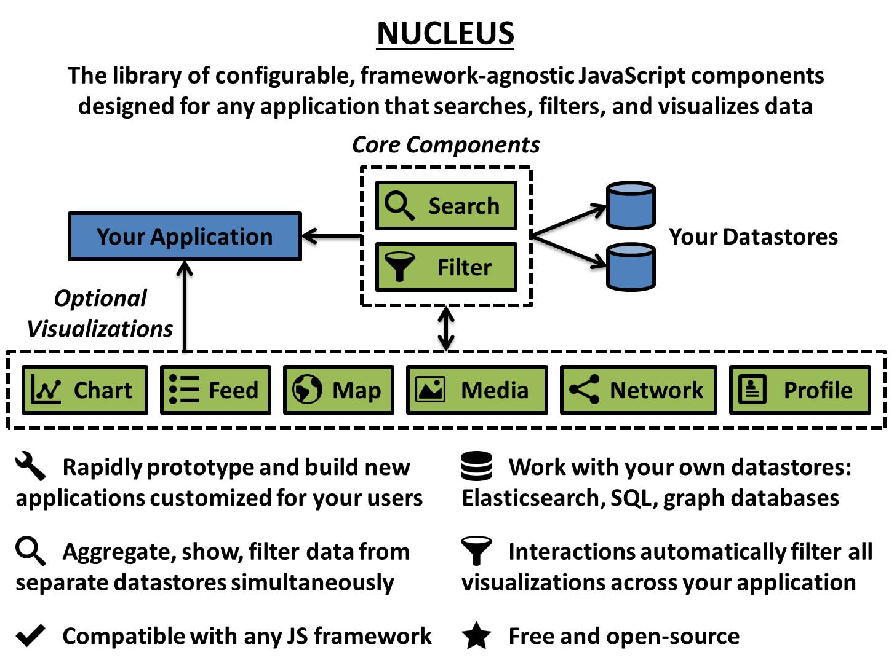
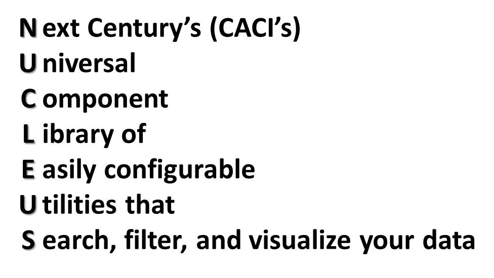
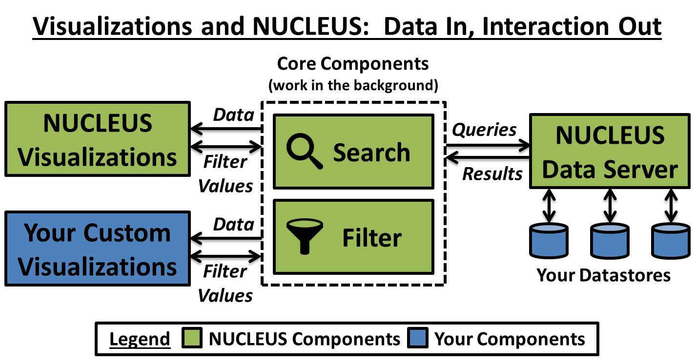
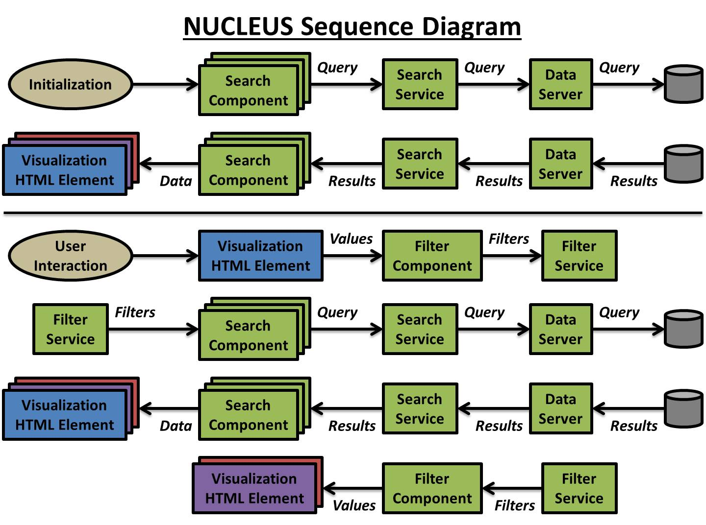
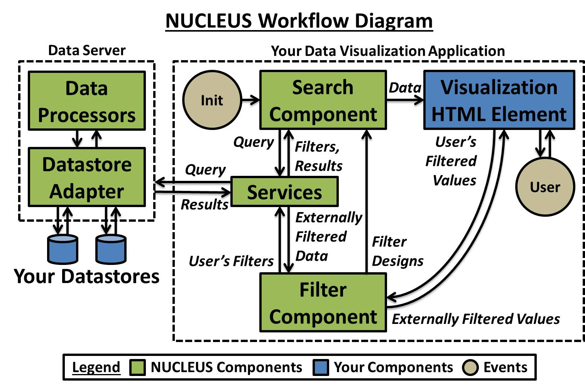
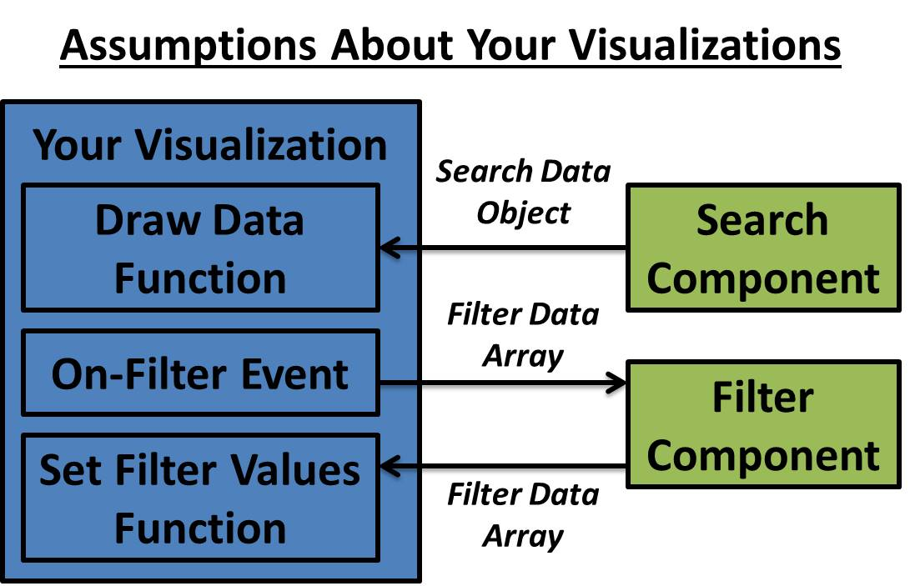
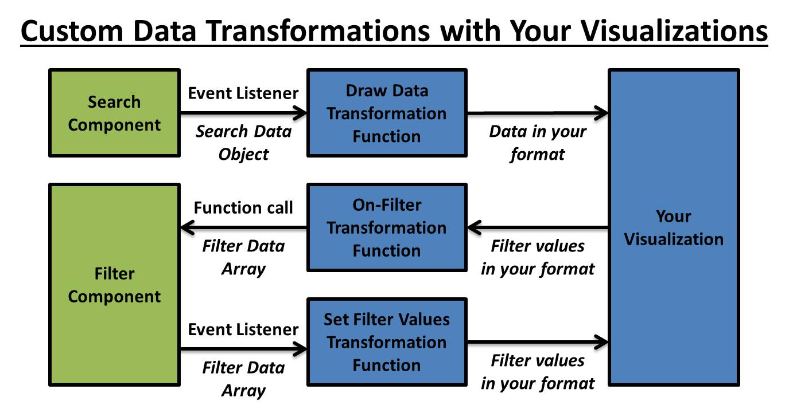

# NUCLEUS



## Table of Content

* [What is NUCLEUS?](#what-is-nucleus)
* [Why should I use NUCLEUS?](#why-should-i-use-nucleus)
* [What is in this repository?](#what-is-in-this-repository)
* [What are the parts of NUCLEUS?](#what-are-the-parts-of-nucleus)
  * [Search Component](#search-component)
  * [Filter Component](#filter-component)
  * [Aggregation Component](#aggregation-component)
  * [Group Component](#group-component)
  * [Visualization Components](#visualization-components)
  * [Services](#services)
  * [Datasets](#datasets)
  * [The Data Server](#the-data-server)
* [How does NUCLEUS work?](#how-does-nucleus-work)
* [How can I use NUCLEUS too?](#how-can-i-use-nucleus-too)
  * [Dependencies](#dependencies)
  * [The Basics](#the-basics)
  * [Using NUCLEUS Visualization Components](#using-nccl-visualization-components)
  * [Using My Visualization Elements](#using-my-visualization-elements)
  * [Using Custom Data Transformations](#using-custom-data-transformations)
  * [Developing in Angular](#developing-in-angular)
  * [Developing in React](#developing-in-react)
  * [Developing in Vue](#developing-in-vue)
* [Example Queries](#example-queries)
* [Definitions](#definitions)
  * [Aggregation Operation](#aggregation-operation)
  * [Datastore Type](#datastore-type)
  * [Dotted Path](#dotted-path)
  * [Externally Filtered Data](#externally-filtered-data)
  * [Field Key](#field-key)
  * [Filter Data Array](#filter-data-array)
  * [Filter Design](#filter-design)
  * [Filter Operator](#filter-operator)
  * [Filter Type](#filter-type)
  * [Filtered Values](#filtered-values)
  * [Group Operation](#group-operation)
  * [Join Type](#join-type)
  * [Relation](#relation)
  * [Search Data Object](#search-data-object)
* [The Neon Dashboard](#the-neon-dashboard)
* [Documentation Links](#documentation-links)
* [License](#license)
* [Contact](#contact)

## What is NUCLEUS?



**NUCLEUS** allows you to rapidly and easily integrate **aggregated searching** and **filtering** capabilities into your **big data visualization application** with **simple, "plug-and-play" components** that interact directly with your own datastores.  NUCLEUS also offers a collection of customizable data visualizations that you can add to your own application.

NUCLEUS is designed for any JavaScript application that searches, filters, and visualizes data.  NUCLEUS's core components are **framework-agnostic** so they can be used with Angular, React, Vue, and more.

## Why should I use NUCLEUS?



NUCLEUS grants multiple unique benefits over other data visualization libraries:

* It is **free** and **open-source**
* It supports **different types of datastores** (see the full list [here](https://github.com/NextCenturyCorporation/neon-server#datastore-support))
* It lets you **view and filter on data from separate datastores at the same time**
* It operates on your own datastores, so it **doesn't need to load and save a copy of your data** (though we have some suggestions on how you should [configure your datastores](https://github.com/NextCenturyCorporation/neon-server#datastore-configuration) so you can make the best use of NUCLEUS)

## What is in this repository?

* [core](./core): Library containing the Core Components (including [Search](#search-component) and [Filter](#filter-component)), the [Services](#services), other objects like [Datasets](#datasets), and their APIs
* [demos](./demos): Runnable demos containing NUCLEUS components and documentation in multiple frameworks
* [visualizations](./visualizations): Library containing the [Visualization Components](#visualization-components) and their APIs
* [wrappers](./wrappers): Libraries of framework-specific visualization wrapper components and their APIs

## What are the parts of NUCLEUS?


### Search Component

The **Search Component** is an HTML Element (JavaScript Web Component) that you define referencing a specific visualization element.  It builds and runs search queries (using the [SearchService](#searchservice)); transforms query results; sends data to its corresponding visualization element; and appends any filters (from the [FilterService](#filterservice)) to its search queries.  It saves [filter designs](#filter-design) from its corresponding [Filter Component(s)](#filter-component) so it can use them to generate the [search data](#search-data-object) and ignore filters on itself (if `enable-ignore-self-filter` is `true`).  Although it is defined in your application's HTML, it does not show any elements in your web browser.  Each visualization element should have one Search Component.

### Filter Component

The **Filter Component** is an HTML Element (JavaScript Web Component) that you define referencing a specific visualization element.  It listens to filter events from its corresponding visualization element; creates [filter designs](#filter-design) from the [filtered values](#filtered-values); and sends the filter designs to the [FilterService](#filterservice).  It also listens when filters are changed by other sources and, if they match its internal filter designs, sends the [externally filtered data](#externally-filtered-data) to the visualization element.  Although it is defined in your application's HTML, it does not show any elements in your web browser.  Each visualization element can have zero or more Filter Components.

### Aggregation Component

The **Aggregation Component** lets you define an [aggregate function](https://en.wikipedia.org/wiki/Aggregate_function) on a field in your search query, like the equivalent SQL functions ([COUNT, AVG, SUM](https://www.w3schools.com/sql/sql_count_avg_sum.asp), [MIN, MAX](https://www.w3schools.com/sql/sql_min_max.asp)).

### Group Component

The **Group Component** lets you define a data grouping on a field in your search query, usually combined with an [aggregate function](#aggregation), like the equivalent SQL function ([GROUP_BY](https://www.w3schools.com/sql/sql_groupby.asp)).  You can also have a "date group" on a date field using a specific time interval.

### Visualization Components

TODO

#### Available Visualizations

TODO

### Services

The Services are singleton classes (not visible elements) that run in your frontend application.

#### FilterService

The **FilterService** manages all of the filters created by your frontend application.  It uses [filter designs](#filter-design) to decide how filters should be added and deleted based on their common fields, operators, and [filter types](#filter-type); notifies listeners whenever filters are changed; and creates filters on configured [relations](#relation).

#### SearchService

The **SearchService** creates the search queries that are sent to NUCLEUS Data Server.

#### ConnectionService

The **ConnectionService** facilitates the connections and communication between your frontend application and NUCLEUS Data Server.

### Datasets

A **Dataset** contains the datastores, databases, tables, and fields that you want to show in your frontend application.  A simple Dataset may have just a single datastore, database, and table.  Each Dataset should have the **datastores object** needed for your application, the [ConnectionService](#connectionService) for your application, the [URL](#data-server-url) for your deployment of the [NUCLEUS Data Server](#the-data-server), and, optionally, a **relations array** of [relations](#relation) for your data.

The **datastores object** contains **datastore IDs** as keys and **datastore objects** as values.  Each **datastore object** must have a `host` string property containing the `hostname` or `hostname:port` of the datastore WITHOUT the `http` prefix; a `type` string property containing the [datastore type](#datastore-type); and a `databases` object property containing **database names** as keys and **database objects** as values.  Each **database object** must have a `tables` object property containing **table names** as keys and **table objects** as values.  Each **table object** may optionally have a `fields` array property of **field objects**.  Each **field object** must have a `columnName` string property containing the field name and may optionally have a `type` string property containing the [field type](#field-type).  A database object, table object, or field object may optionally have a `prettyName` string property containing the object's user-friendly name.

The **relations array** contains one or more nested **relation arrays**; each **relation array** contains one or more strings or nested string arrays; each string, or each individual nested string array, is a **set of relation fields**.  A **relation array** must have more than one **set of relation fields**, and each **set of relation fields** must have the same number of array elements (or must all be single strings).  Creating a filter containing a combination of fields exactly matching one **set of relation fields** will automatically generate additional filters with the same operators and [type](#filter-type) but substituting each other **set of relation fields** (one filter per set).  See [Relation Examples](#relation-examples) below.

#### Data Server URL

The **data server URL** should be the hostname of your deployed [NUCLEUS Data Server](#the-data-server) WITH the `http` or `https` prefix if needed.  It should also have an endpoint matching the `server.servlet.context-path` set in the Data Server's [`application.properties`](https://github.com/NextCenturyCorporation/neon-server/blob/master/server/src/main/resources/application.properties) file, WITHOUT the `/services` part.  For example, if your Data Server is deployed at `http://my_server.com:1234` and its `server.servlet.context-path` is set to `/abcd/services`, then your Dataset's data server URL should be `http://my_server.com:1234/abcd`.

#### Dataset Examples

```js
// Define your datastores, databases, tables, and (optionally) fields.
// NUCLEUS will automatically detect fields if they are not defined.
const fieldArray = [];
const tableObject = TableConfig.get({
    fields: fieldArray
});
const databaseObject = DatabaseConfig.get({
    tables: {
        table_name: tableObject // Change the table_name here as needed
        // Insert additional tables here as needed
    }
});
const datastoreObject = DatastoreConfig.get({
    host: 'localhost:9200', // Change the host and port here as needed
    type: 'elasticsearch', // Change the type here as needed
    databases: {
        database_name: databaseObject // Change the database_name here as needed
        // Insert additional databases here as needed
    }
});
const datastores = {
    datastore_id: datastoreObject // Change the datastore_id here as needed
    // Insert additional datastores here as needed
};
// Create a single copy of the NUCLEUS ConnectionService.
const connectionService = new ConnectionService();
// Define your NUCLEUS Data Server hostname.
const dataServerUrl = 'http://localhost:8090/neon';
// Define relations to manage simultaneous filtering across datastores (if needed).
const relations = [];
// Create a single Dataset object with your datastores.
const dataset = new Dataset(datastores, connectionService, dataServerUrl, relations);
```

#### Elasticsearch Datastores

Elasticsearch does not have "databases" or "tables"; instead, it has "indexes" and "mapping types". In NUCLEUS, we consider "indexes" to be the equivalent of "databases" and "mapping types" to be the equivalent of "tables".  For Elasticsearch 7+, please note that the default mapping type is `'_doc'`.  See the [NUCLEUS Data Server's README file](https://github.com/NextCenturyCorporation/neon-server#datastore-configuration) on more information about configuring Elasticsearch datastores.

Elasticsearch Datastore Example:

```js
const fieldArray = [];
const tableObject = TableConfig.get({
    fields: fieldArray
});
const databaseObject = DatabaseConfig.get({
    tables: {
        index_type: tableObject // Change the index_type here as needed
    }
});
const datastoreObject = DatastoreConfig.get({
    host: 'localhost:9200', // Change the host and port here as needed
    type: 'elasticsearch',
    databases: {
        index_name: databaseObject // Change the index_name here as needed
        // Insert additional NUCLEUS "databases" (meaning Elasticsearch indexes) here as needed
    }
});
```

#### PostgreSQL Datastores

PostgreSQL connections are always database-specific, so any `'postgresql'` datastore must have its `host` property end with a slash and the database name (`'host:port/database'`). In NUCLEUS, we consider PostgreSQL "schemas" to be the equivalent of "databases".

PostgreSQL Datastore Example:

```js
const fieldArray = [];
const tableObject = TableConfig.get({
    fields: fieldArray
});
const databaseObject = DatabaseConfig.get({
    tables: {
        table_name: tableObject // Change the table_name here as needed
        // Insert additional tables here as needed
    }
});
const datastoreObject = DatastoreConfig.get({
    host: 'localhost:9200/database_name', // Change the host, port, and database_name here as needed
    type: 'postgresql',
    databases: {
        schema_name: databaseObject // Change the schema_name here as needed
        // Insert additional NUCLEUS "databases" (meaning PostgreSQL schemas) here as needed
    }
});
```

#### Relation Examples

Basic Example:

```js
const relations = [ // relations array
    [ // single nested relation array
        [ // set of relation fields
            'datastore1.database1.table1.fieldA',
            'datastore1.database1.table1.fieldB'
        ],
        [
            'datastore1.database1.table2.fieldX',
            'datastore1.database1.table2.fieldY'
        ]
    ]
];
// Whenever the FilterService creates a filter containing both fieldA and fieldB, create a
// relation filter by copying the filter and replacing fieldA with fieldX and fieldB with
// fieldY.  Do the reverse whenever the FilterService creates a filter containing both
// fieldX and fieldY.  Do not create a relation filter on a filter containing just fieldA,
// or just fieldB, or just fieldX, or just fieldY, or more than fieldA and fieldB, or more
// than fieldX and fieldY.
```

Complex Example:

```js
const relations = [
    [
        // Relation of two date/time fields in separate tables.
        // Defined as single strings.
        // All matching filters must have exactly one field.
        'datastore_id.database_name_1.table_name_1A.date_field',
        'datastore_id.database_name_1.table_name_1B.time_field'
    ], [
        // Relation of three user/name fields in separate databases.
        // Defined as arrays of one string, but could also be defined as single strings.
        // All matching filters must have exactly one field.
        ['datastore_id.database_name_1.table_name_1A.name_field'],
        ['datastore_id.database_name_2.table_name_2A.user_field'],
        ['datastore_id.database_name_3.table_name_3A.username_field']
    ], [
        // Relation of two latitude/longitude fields in separate datastores.
        // Defined as arrays of two strings.
        // All matching filters must have exactly both fields.
        [
            'datastore_id.database_name.table_name.latitude_field',
            'datastore_id.database_name.table_name.longitude_field'
        ],
        [
            'other_datastore_id.other_database_name.other_table_name.latitude_field',
            'other_datastore_id.other_database_name.other_table_name.longitude_field'
         ]
    ]
];
```

### The Data Server

NUCLEUS [**Data Server**](https://github.com/NextCenturyCorporation/neon-server), formerly called the "Neon Server", is a Java REST Server that serves as an intermediary between your frontend application and your datastores.  Its job is to provide datastore adapters, run datastore queries, transform query results, and perform optional data processing.  The [**Search Component**](#search-component) sends queries to it and receives query results from it using the [SearchService](#searchservice).  As a standalone application, NUCLEUS Data Server must be deployed separately from your frontend application.

## How does NUCLEUS work?





### Setup

* Import the [NUCLEUS Core Components, Models, and Services](https://www.npmjs.com/package/@caci-critical-insight-solutions/nucleus-core) and the [Web Component polyfills](https://www.npmjs.com/package/@webcomponents/webcomponentsjs) from NPM into your frontend application.
* Define a [**Search Component**](#search-component) and zero or more [**Filter Components**](#filter-component) for each of your application's data visualizations (or import and use NUCLEUS [**Visualization Components**](#visualizations)).
* Create [**Dataset**](#datasets), [**FilterService**](#filterservice), and [**SearchService**](#searchservice) objects and use them to initialize your Search and Filter Components.
* Separately, deploy the [**NUCLEUS Data Server**](#the-data-server) so that it can communicate with your frontend application and your datastores.  You may want to change its default configuration; see [Data Server URL](#data-server-url) for information.

### Runtime

1. When a **Search Component** is initialized (typically on page load), it will automatically run a search query using its configured attributes, dataset, and services.  The query request is sent using the **SearchService** to the **Data Server** which passes the query to the datastore and returns the query results back to that **Search Component**.
2. The **Search Component** transforms the query results into a [search data object](#search-data-object), combining each result with the query's corresponding aggregations and its filtered status.
3. The **Search Component** sends the search data object to its corresponding visualization, either by calling the visualization's draw function itself or by emitting an event that notifies a custom event listener to send the search data object to the visualization.
4. The visualization renders the search data.
5. When a user's interaction with a visualization should generate a filter on some data (for example, clicking on an element), that visualization will dispatch an event to notify its corresponding **Filter Component**.
6. When a **Filter Component** is notified with a filter event from its corresponding visualization, it will create a new filter and send it to the **FilterService**.
7. When the **FilterService** is sent a filter, it notifies each relevant **Search Component** to automatically run a new search query using that filter and have its visualization re-render the search data (see 1-4).  A Search Component is relevant if the datastore, database, and table in its `search-field-keys` match a datastore, database, and table in the new filter(s).
8. Additionally, when the **FilterService** is sent a filter, it also notifies each relevant **Filter Component** to pass the [externally filtered data](#externally-filtered-data) onto its corresponding visualization if needed.  A Filter Component is relevant if its [filter designs](#filter-design) match the new filter(s).

## How can I use NUCLEUS too?

### Dependencies

Your frontend application must import the following dependencies from NPM:

* The [NUCLEUS Core Components, Models, and Services](https://www.npmjs.com/package/@caci-critical-insight-solutions/nucleus-core)
* The [Web Components Polyfills](https://www.npmjs.com/package/@webcomponents/webcomponentsjs)
* (Optionally) One or more of the [NUCLEUS Visualization Components](https://www.npmjs.com/package/@caci-critical-insight-solutions/nucleus-visualizations)

Additionally, you must have a deployed instance of the [NUCLEUS Data Server](https://github.com/NextCenturyCorporation/neon-server).

### The Basics

#### Initializing NUCLEUS Core Services and Components

1. Create a single copy of each of the [Services](#services) to share with ALL of your Components.
2. Create a single [Dataset](#datasets) containing each of your datastores, databases, and tables.
3. Initialize each of your [Filter Components](#search-and-filter) with the Dataset and FilterService.
4. Initialize each of your [Search Components](#search-and-filter) with the Dataset, FilterService, and SearchService.

```js
// Create a single copy of each core Service to share with each NUCLEUS Component.
const connectionService = new ConnectionService();
const filterService = new FilterService();
const searchService = new SearchService(connectionService);

// Define your NUCLEUS Data Server hostname.
const dataServer = 'http://localhost:8090';

// Define your datastores, databases, tables, and (optionally) fields.
// NUCLEUS will automatically detect fields if they are not defined.
const fieldArray = [];
const tableObject = TableConfig.get({
    fields: fieldArray
});
const databaseObject = DatabaseConfig.get({
    tables: {
        table_name: tableObject // Change the table_name here as needed
        // Insert additional tables here as needed
    }
});
const datastoreObject = DatastoreConfig.get({
    host: 'localhost:9200', // Change the host and port here as needed
    type: 'elasticsearch', // Change the type here as needed
    databases: {
        database_name: databaseObject // Change the database_name here as needed
        // Insert additional databases here as needed
    }
});
const datastores = {
    datastore_id: datastoreObject // Change the datastore_id here as needed
    // Insert additional datastores here as needed
};

// Define relations to manage simultaneous filtering across datastores (if needed).
const relations = [];

// Create a single Dataset object with your datastores.
const datasetObject = new Dataset({
    datastore_id: datastoreObject
}, connectionService, dataServer, relations);

// Initialize each Filter Component with the Dataset and FilterService.
document.querySelector('filter1').init(datasetObject, filterService);

// Initialize each Search Component with the Dataset, FilterService, and SearchService.
document.querySelector('search1').init(datasetObject, filterService, searchService);
```

#### Search

1. Define your **Visualization element** and give it an `id` attribute.
2. Define a **[Search Component](#search-component)** and give it an `id` attribute.
3. This Search Component will be querying one or more fields in a specific datastore/database/table.  Give the Search element a `search-field-keys` attribute containing the [field-key](#field-key) of the specific query field, or replace the field in the field key with a `*` (wildcard symbol) if querying multiple fields in the table.
4. Unless your Visualization element does not have an applicable "draw data" function (see [Using My Visualization Elements](#using-my-visualization-elements) below), give the Search Component a `vis-element-id` attribute containing the `id` of your Visualization element and a `vis-draw-function` attribute containing the name of the Visualization's"draw data" function.

```html
<visualization-element id="vis1"></visualization-element>

<nucleus-search
    id="search1"
    search-field-keys="es.index_name.index_type.*"
    vis-draw-function="drawData"
    vis-element-id="vis1"
>
</nucleus-search>
```

#### Search with Aggregations and Groups

1. Define your **Visualization element** and a **[Search Component](#search-component)** as normal ([see above](#search)).
2. Inside the Search Component, define a **[Group Component](#group-component)** and an **[Aggregation Component](#aggregation-component)**.
3. Give the Group Component a `field-key` attribute containing the [field-key](#field-key) of the specific group field.
4. Give the Aggregation Component a `field-key` attribute containing the [field-key](#field-key) of the specific aggregation field (probably the same as a corresponding group field), a `name` attribute for the unique aggregation name, and a `type` attribute for the [type of aggregation function](#aggregation-operation).  Instead of a `field-key`, you may use the `group` attribute for the name of an [advanced grouping](#group-operation) defined in a Group Component.

```html
<visualization-element id="vis1"></visualization-element>

<nucleus-search
    id="search1"
    search-field-keys="es.index_name.index_type.username_field"
    vis-draw-function="drawData"
    vis-element-id="vis1"
>
    <nucleus-group
        group-field-key="es.index_name.index_type.username_field"
    >
    </nucleus-group>

    <nucleus-aggregation
        aggregation-field-key="es.index_name.index_type.username_field"
        aggregation-label="_records"
        aggregation-operation="count"
    >
    </nucleus-aggregation>
</nucleus-search>
```

#### Search and Filter

1. Define your **Visualization element** and a **[Search Component](#search-component)** as normal ([see above](#search)).
2. Define a **[Filter Component](#filter-component)** and give it an `id` attribute.
3. This Filter Component will be creating filters of a specific [filter type](#filter-type).  Give the Filter Component all of the attributes required by the chosen filter type.
4. This Filter Component will be sending [filter designs](#filter-design) to the Search Component.  Give the Filter Component a `search-element-id` attribute containing the `id` of the Search Component.
5. This Filter Component will be receiving [filtered values](#filtered-values) from filter events sent by the Visualization element.  Unless your Visualization element does not have a filter event with applicable event data (see [Using My Visualization Elements](#using-my-visualization-elements) below), give the Filter Component a `vis-element-id` attribute containing the `id` of the Visualization element and a `vis-filter-output-event` attribute containing the name of the Visualization's filter event.
6. Unless your Visualization element does not have an applicable "change filters" function (see [Using My Visualization Elements](#using-my-visualization-elements) below), give the Filter Component a `vis-element-id` attribute containing the `id` of your Visualization element and a `vis-filter-input-function` attribute containing the name of the Visualization's "change filters" function.

```html
<visualization-element id="vis1"></visualization-element>

<nucleus-search
    id="search1"
    search-field-keys="es.index_name.index_type.*"
    vis-draw-function="drawData"
    vis-element-id="vis1"
>
</nucleus-search>

<nucleus-filter
    id="filter1"
    filter-type="list"
    list-field-key="es.index_name.index_type.id_field"
    list-operator="="
    search-element-id="search1"
    vis-element-id="vis1"
    vis-filter-input-function="changeSelectedData"
    vis-filter-output-event="dataSelected"
>
</nucleus-filter>
```

#### Search and Filter with Aggregations and Groups

```html
<visualization-element id="vis1"></visualization-element>

<nucleus-search
    id="search1"
    search-field-keys="es.index_name.index_type.username_field"
    vis-draw-function="drawData"
    vis-element-id="vis1"
>
    <nucleus-aggregation
        aggregation-field-key="es.index_name.index_type.username_field"
        aggregation-label="_records"
        aggregation-operation="count"
    >
    </nucleus-aggregation>

    <nucleus-group
        group-field-key="es.index_name.index_type.username_field"
    >
    </nucleus-group>
</nucleus-search>

<nucleus-filter
    id="filter1"
    filter-type="list"
    list-field-key="es.index_name.index_type.username_field"
    list-operator="="
    search-element-id="search1"
    vis-element-id="vis1"
    vis-filter-input-function="changeSelectedData"
    vis-filter-output-event="dataSelected"
>
</nucleus-filter>
```

#### Search with Multiple Filters

```html
<visualization-element id="vis1"></visualization-element>

<nucleus-search
    id="search1"
    search-field-keys="es.index_name.index_type.*"
    vis-draw-function="drawData"
    vis-element-id="vis1"
>
    <nucleus-aggregation
        aggregation-field-key="es.index_name.index_type.username_field"
        aggregation-label="_records"
        aggregation-operation="count"
    >
    </nucleus-aggregation>

    <nucleus-group
        group-field-key="es.index_name.index_type.username_field"
    >
    </nucleus-group>

    <nucleus-group
        group-field-key="es.index_name.index_type.text_field"
    >
    </nucleus-group>
</nucleus-search>

<nucleus-filter
    id="filter1"
    filter-type="list"
    list-field-key="es.index_name.index_type.username_field"
    list-operator="="
    search-element-id="search1"
    vis-element-id="vis1"
    vis-filter-input-function="changeSelectedUsername"
    vis-filter-output-event="usernameSelected"
>
</nucleus-filter>

<nucleus-filter
    id="filter2"
    filter-type="list"
    list-field-key="es.index_name.index_type.text_field"
    list-operator="="
    search-element-id="search1"
    vis-element-id="vis1"
    vis-filter-input-function="changeSelectedText"
    vis-filter-output-event="textSelected"
>
</nucleus-filter>
```

#### Search with Joins

Please note that NUCLEUS joins only work with SQL datastores (not Elasticsearch).  If you would like to "join" on Elasticsearch data across multiple indexes, we recommend that you denormalize the data in your indexes and define [relations](#relations) in your [Dataset](#datasets).

```html
<visualization-element id="vis1"></visualization-element>

<nucleus-search
    id="search1"
    search-field-keys="es.index_name_1.index_type_1.username_field"
    vis-draw-function="drawData"
    vis-element-id="vis1"
>
    <nucleus-join
        join-field-key-1="es.index_name_1.index_type_1.username_field"
        join-field-key-2="es.index_name_2.index_type_2.username_field"
        join-operator="="
        join-table-key="es.index_name_2.index_type_2"
        join-type="full"
    >
    </nucleus-join>
</nucleus-search>
```

### Using NUCLEUS Visualization Components

#### Framework-Agnostic Visualization Examples

```html
<!-- Simple Examples -->
<nucleus-text-cloud
    id="textCloud1"
    text-field-key="es.index_name.index_type.text_field"
>
</nucleus-text-cloud>

<!-- Advanced Examples -->
<nucleus-text-cloud
    id="textCloud2"
    enable-hide-if-unfiltered
    enable-ignore-self-filter
    enable-intersection-filter
    enable-show-counts
    strength-aggregation="avg"
    strength-field-key="es.index_name.index_type.size_field"
    text-field-key="es.index_name.index_type.text_field"
>
</nucleus-text-cloud>
```

```js
const textCloud1 = document.querySelector('textCloud1');
textCloud1.init(dataset, filterService, searchService);

const textCloud2 = document.querySelector('textCloud2');
textCloud2.init(dataset, filterService, searchService);
```

#### What Does It Render?

```html
<nucleus-base-text-cloud
    id="textCloud1Vis"
    aggregation-field="aggregations._count"
    text-field="fields.text_field"
>
</nucleus-base-text-cloud>

<nucleus-search
    id="textCloud1Search"
    search-field-keys="es.index_name.index_type.text_field"
    search-limit=10000
    sort-aggregation="_count"
    sort-order="descending"
    vis-draw-function="drawData"
    vis-element-id="textCloud1Vis"
>
    <nucleus-aggregation
        aggregation-field-key="es.index_name.index_type.text_field"
        aggregation-label="_count"
    >
    </nucleus-aggregation>
    <nucleus-group
        group-field-key="es.index_name.index_type.text_field"
    >
    </nucleus-group>
</nucleus-search>

<nucleus-filter
    id="textCloud1Filter"
    filter-type="list"
    list-field-key="es.index_name.index_type.text_field"
    list-operator="="
    search-element-id="textCloud1Search"
    vis-element-id="textCloud1Vis"
    vis-filter-input-function="changeFilteredText"
    vis-filter-output-event="filter"
>
</nucleus-filter>
```

```js
public init(dataset: Dataset, filterService: FilterService, searchService: SearchService) {
    const filterComponent = document.querySelector('textCloud1Filter');
    filterComponent.init(dataset, filterService);
    const searchComponent = document.querySelector('textCloud1Search');
    searchComponent.init(dataset, filterService, searchService);
}
```

#### Framework-Specific Visualization Wrappers

* [Developing in Angular](#developing-in-angular)
* [Developing in React](#developing-in-react)
* [Developing in Vue](#developing-in-vue)

### Using My Visualization Elements



To use your own Visualization Elements:

1. It's best if your Visualization element has a "draw data" function that accepts an **[array of search data objects](#search-data-object)**.  If it does not, you will need to add a `searchFinished` event listener to a Search Component and use [search data transformations](#transforming-search-data-to-send-to-my-visualization) to notify your Visualization element to render the search data.  Ideally (though not required), the "draw data" function should return the number of data elements in the visualization, if different from the size of the input data array.
2. If you want your Visualization element to generate search filters, it's best if your Visualization element emits filter events with a `values` property in its [event detail](https://developer.mozilla.org/en-US/docs/Web/API/CustomEvent/detail) containing a **[filter data array](#filter-data-array)**.  If it does not, you will need to use [filter output data transformations](#transforming-filter-data-sent-from-my-visualization) to call the `updateFilters` function on the Filter Component in order for it to create the new filters.
3. We recommend that all filterable visualizations should be able to accept [externally filtered data](#externally-filtered-data), so it's best if your Visualization element has a "change filters" function that accepts a **[filter data array](#filter-data-array)**.  If it does not, you will need to use [filter input data transformations](#transforming-filter-data-to-send-to-my-visualization) to notify your Visualization element to change its [filtered values](#filtered-values).

### Using Custom Data Transformations



#### Transforming Search Data to Send to My Visualization

1. Define your Visualization element and Search Component as normal ([see above](#search-and-visualize)), but you do not need to add the `vis-element-id` or `vis-draw-function` attributes to the Search Component.
2. Define a transform function that accepts an **[array of search data objects](#search-data-object)**, transforms it into your data format, and sends the transformed visualization data to your Visualization element by whatever method you desire (like a direct function call or attribute data binding).
3. Add your transform function as an event listener to the `searchFinished` event on the Search Component.
4. Initialize the Search Component as normal ([see above](#initializing-nccl-core-services-and-components)).

```js
const transformSearchDataArray = function(event) {
    const searchDataArray = event.detail.data;

    // Transform the searchDataArray into your visualization-element's expected data format.
    const yourData = searchDataArray.reduce((searchDataObject) => { ... }, []);

    // Send the transformed visualization data to your visualization-element by whatever method you desire.
    const vis1 = document.querySelector('vis1');
    vis1.drawData(yourData);
};

const search1 = document.querySelector('search1');
search1.addEventListener('searchFinished', transformSearchDataArray);
```

```html
<visualization-element id="vis1"></visualization-element>

<nucleus-search
    id="search1"
    search-field-keys="es.index_name.index_type.*"
>
</nucleus-search>
```

#### Transforming Filter Data Sent from My Visualization

1. Define and initialize your Visualization element, Search Component, and Filter Component as normal ([see above](#search-and-filter)), but you do not need to add the `vis-filter-output-event` attribute to the Filter Component.
2. Define a transform function that accepts your Visualization element's filter event data, transforms it into a **[filter data array](#filter-data-array)**, and sends the filter data array to the Filter Component by calling its `updateFilters` function.
3. Add your transform function as an event listener to your filter event on your Visualization element (or call the transform function by whatever method you desire).
4. Initialize the Filter and Search Components as normal ([see above](#initializing-nccl-core-services-and-components)).

```js
const transformFilterEventData = function(event) {
    // Transform the filter event data from your visualization-element's output data format.
    const filterDataArray = [event.detail.your_property];

    // Send the filter data array to the Filter Component by calling updateFilters.
    const filter1 = document.querySelector('filter1');
    filter1.updateFilters(filterDataArray);
};

const vis1 = document.querySelector('vis1');
vis1.addEventListener('yourFilterEvent', transformFilterEventData);
```

```html
<visualization-element id="vis1"></visualization-element>

<nucleus-search
    id="search1"
    search-field-keys="es.index_name.index_type.*"
    vis-draw-function="drawData"
    vis-element-id="vis1"
>
</nucleus-search>

<nucleus-filter
    id="filter1"
    filter-type="list"
    list-field-key="es.index_name.index_type.id_field"
    list-operator="="
    search-element-id="search1"
    vis-element-id="vis1"
    vis-filter-input-function="changeSelectedData"
>
</nucleus-filter>
```

#### Transforming Filter Data to Send to My Visualization

1. Define and initialize your Visualization element, Search Component, and Filter Component as normal ([see above](#search-and-filter)), but you do not need to add the `vis-filter-input-function` attribute to the Filter Component.
2. Define a transform function that accepts a **[filter data array](#filter-data-array)**, transforms it into your data format, and sends the transformed filter data to your Visualization element by whatever method you desire (like a direct function call or attribute data binding).
3. Add your transform function as an event listener to the `valuesFiltered` event on the Filter Component.
4. Initialize the Filter and Search Components as normal ([see above](#initializing-nccl-core-services-and-components)).

```js
const transformFilterDataArray = function(event) {
    const filterDataArray = event.detail.values;

    // Transform the filterDataArray into your visualization-element's expected data format.
    const yourData = filterDataArray.reduce((filterData) => { ... }, []);

    // Send the transformed filter data to your visualization-element by whatever method you desire.
    const vis1 = document.querySelector('vis1');
    vis1.changeFilters(yourData);
};

const filter1 = document.querySelector('filter1');
filter1.addEventListener('valuesFiltered', transformFilterDataArray);
```

```html
<visualization-element id="vis1"></visualization-element>

<nucleus-search
    id="search1"
    search-field-keys="es.index_name.index_type.*"
    vis-draw-function="drawData"
    vis-element-id="vis1"
>
</nucleus-search>

<nucleus-filter
    id="filter1"
    filter-type="list"
    list-field-key="es.index_name.index_type.id_field"
    list-operator="="
    search-element-id="search1"
    vis-element-id="vis1"
    vis-filter-output-event="dataSelected"
>
</nucleus-filter>
```

### Example with a Simple Data Visualization and Custom Data Transformations

Here is an example of using NUCLEUS Search and Filter Components to generate a "data visualization" of HTML `<div>` elements.

```html
<div id="vis1">
  <div id="container1"></div>
</div>

<nucleus-search
    id="search1"
    search-field-keys="es.index_name.index_type.*"
>
</nucleus-search>

<nucleus-filter
    id="filter1"
    filter-type="list"
    list-field-key="es.index_name.index_type.id_field"
    list-operator="="
    search-element-id="search1"
>
</nucleus-filter>
```

```js
const filterElement1 = document.querySelector('filter1');
const searchElement1 = document.querySelector('search1');
const visElement1 = document.querySelector('vis1');

let containerElement1 = document.querySelector('container1');

const transformSearchDataArray = function(event) {
    // Replace the old element with a new blank element.
    let newElement = document.createElement('div');
    this.replaceChild(newElement, containerElement1);
    containerElement1 = newElement;
    
    event.detail.data.forEach((searchDataObject) => {
        // Add a new element to the HTML for each NUCLEUS search data object (result).
        let resultElement = document.createElement('div');
        resultElement.innerHTML = JSON.stringify(searchDataObject);
        // Add an onclick attribute that dispatches a custom event for the NUCLEUS filter component.
        resultElement.onclick = () => {
            this.dispatchEvent(new CustomEvent('dataSelected', {
                bubbles: true,
                detail: {
                    // We save a custom property ("value") with the value to filter (the value from the result's "id_field")
                    value: searchDataObject.fields.id_field
                }
            }));
        };
        containerElement1.appendChild(resultElement);
    });
};

const transformFilterEventData = function(event) {
    // Use this custom filter event listener to pass the filtered values to the NUCLEUS filter component.
    filterElement1.updateFilters([event.detail.value]);
};

// Listen to the event dispatched by the NUCLEUS search component.
searchElement1.addEventListener('searchFinished', transformSearchDataArray);

// Listen to the event dispatched by our custom HTML elements (created in the transformSearchDataArray function).
visElement1.addEventListener('dataSelected', transformFilterEventData);
```

### Developing in Angular

To use NUCLEUS in Angular applications, you can import, define, and initialize the NUCLEUS web components (as described above) or the [Angular Wrapper Components](./wrappers/angular) (downloadable from NPM [here](https://www.npmjs.com/package/@caci-critical-insight-solutions/nucleus-wrappers-angular)).  The wrapper components allow you to bind the [Dataset](#datasets), [Services](#services), and options as attributes on the HTML element without the need to call the `init` function.

You must also import the [Web Components Polyfills](https://www.webcomponents.org/polyfills) into your Angular application.  The specific implementation may change depending on your application's configuration, but, generally, you will need to:

* Add the `@webcomponents/webcomponentsjs` to your `package.json` `devDependencies`.
* Import the `webcomponents/webcomponents-loader.js` `script` in your application's HTML.

Finally, you must add the [CUSTOM_ELEMENTS_SCHEMA](https://angular.io/api/core/CUSTOM_ELEMENTS_SCHEMA) to your App Module.

You can find an example implementation (with documentation) in the [NUCLEUS Angular Demo App](./demos/angular).

### Developing in React

TODO

### Developing in Vue

To use NUCLEUS in Vue applications, you can import, define, and initialize the NUCLEUS web components (as described above) or the [Vue wrapper components](./wrappers/vue) (COMING SOON!).  The wrapper components allow you to bind the [Dataset](#datasets), [Services](#services), and options as attributes on the HTML element without the need to call the `init` function.

You must also import the [Web Components Polyfills](https://www.webcomponents.org/polyfills) into your Vue application.  The specific implementation may change depending on your application's configuration, but, generally, you will need to:

* Add the `@webcomponents/webcomponentsjs` and `copy-webpack-plugin` to your `package.json` `devDependencies`.
* Import the `webcomponents/webcomponents-loader.js` `script` in your application's HTML.
* Add a `configureWebpack` plugin in your `vue.config.js` file to copy the webcomponents scripts using the `CopyWebpackPlugin`.

```js
configureWebpack: {
    plugins: [
        new CopyWebpackPlugin([{
            context: 'node_modules/@webcomponents/webcomponentsjs',
            from: '**/*.js',
            to: 'webcomponents'
        }])
    ]
}
 ```

You can find an example implementation (with documentation) in the [NUCLEUS Vue Demo App](./demos/vue).

## Example Queries

Please see [this page](./NUCLEUS_EXAMPLE_QUERIES.md).

## Definitions

### Aggregation Operation

* Count (`'count'`), the default
* Average (`'avg'`)
* Maximum (`'max'`)
* Minimum (`'min'`)
* Sum (`'sum'`)

### Datastore Type

* Elasticsearch 6.7+ (`'elasticsearch'` or `'elasticsearchrest'`)
* MySQL (`'mysql'`)
* PostgreSQL (`'postgresql'`)

### Dotted Path

A **dotted path** is a string that denotes a specific top-level or nested property within an unclassed JavaScript JSON object (TypeScript Record).  A top-level property is just the property's name.  A nested property is the property path separated by periods.

For example, given the following object:

```js
const obj = {
    a: 1,
    b: {
        c: 2
    },
    d: {
        e: 3,
        f: [4, 5, 6],
        g: [{
            h: 7
        }, {
            h: 8
        }]
    }
};
```

The following dotted paths would denote the values in `obj`:

- `"a"` is `1`
- `"b"` is `{ c: 2 }`
- `"b.c"` is `2`
- `"d.e"` is `3`
- `"d.f"` is `[4, 5, 6]`
- `"d.g.h"` is `[7, 8]`

### Externally Filtered Data

Most filterable visualizations have a way to generate filters by interacting with the visualization itself (like clicking on an element).  However, sometimes we want a visualization to show a filter that was generated outside the visualization.  For example:

* We have two visualizations, a legend and a data list, and, when an option in the legend is selected (and generates a filter), we want to highlight that selected value in the data list.
* We have two separate line charts showing different data over the same time period and, when a time period is selected in one chart (and generates a filter), we want to highlight that selected time period in the second chart.

An **externally set filter** is a filter that is applicable to the visualization but was not originally generated by the visualization.  This way, you have the option to change or redraw your visualization based on these filters.

### Field Key

A **field key** is a string containing a **unique datastore identifier**, **database name**, **table name**, and **field name**, separated by dots (i.e. `datastore_id.database_name.table_name.field_name`).  Remember that, with Elasticsearch, we equate **indexes** with databases and **mapping types** with tables.  Field keys are similar to [table keys](#table-key).

### Filter Data Array

A **filter data array** contains [filtered values](#filtered-values) in a format depending on the [type of filter](#filter-type) that will be created.  Values should be `boolean`, `number`, or `string` primitives, `Date` objects, or `null`.

A **List Filter** contains data in one of two formats:  first, it may be a single value, not in an array (yes, the name "filter data array" is confusing in this case); second, it may be an array of one or more values.  All of the values will be included in the filter.

A **Bounds Filter** contains exactly four values in a specific order: `begin1, begin2, end1, end2`, where `begin1` and `end1` correspond to `fieldKey1` while `begin2` and `end2` correspond to `fieldKey2`.

A **Domain Filter** contains exactly two values in a specific order: `begin, end1`.

A **Pair Filter** contains exactly two values in a specific order: `value1, value2`, where `value1` corresponds to `fieldKey1` while `value2` corresponds to `fieldKey2`.

Any filter data array may be nested inside another array.  In this case, a filter will be created using each nested filter data array.

Examples:

```js
const listFilterData1 = 'a';
const listFilterData2 = ['a', 'b', 'c'];
const listFilterData3 = [['a'], ['b', 'c']];

const boundsFilterData1 = [1, 2, 3, 4];
const boundsFilterData2 = [[1, 2, 3, 4], [5, 6, 7, 8]];

const domainFilterData1 = [1, 2];
const domainFilterData2 = [[1, 2], [3, 4]];

const pairFilterData1 = ['a', 'b'];
const pairFilterData2 = [['a', 'b'], ['c', 'd']];
```

### Filter Design

A **filter design** contains the data needed to create specific filter, including [field key(s)](#field-key), operator(s), values, and [filter type](#filter-type).  The FilterService transforms filter designs into filter objects that it then saves and gives to the Search Component.

However, a filter design can also be made without any values.  In this case, it's used to match all filters with the same field keys, operators, and filter type (and nested format for compound filters) but different values.  Each Filter Component creates filters of a specific design; the Search Component uses the filter designs from its corresponding Filter Components to identify [externally filtered data](#externally-filtered-data).

### Filter Operator

* Equals (`=`)
* Not Equals (`!=`)
* Contains (`contains`)
* Not Contains (`not contains`)
* Greater Than (`>`)
* Less Than (`<`)
* Greter Than or Equal To (`>=`)
* Less Than or Equal To (`<=`)

Note that a filter on `field != null` or `field = null` is equivalent to an "exists" or "not exists" filter, respectively.

### Filter Type

#### List Filter

**List Filters** are the most common type of filter.  They require that all records have values in a specific field that satify a specific [operator](#filter-operator) (like "equals" or "not equals") and one or more values.  By default, a record needs only to satisfy one of the listed values; however, if the `list-intersection` attribute on the Filter Component is true, a record must match ALL of the listed values.

Example:

```js
{
    fieldKey: 'es.index_name.index_type.field_name',
    operator: '=',
    values: ['a', 'b', 'c']
}
```

Filter Component Attributes:

* `list-field-key` (string, a [field key](#field-key))
* `list-intersection` (boolean)
* `list-operator` (string, a [filter operator](#filter-operator))
* `type` of `'list'`

#### Bounds Filter

**Bounds Filters** are intended for use with numeric data in visualizations like maps and scatter plots.  They require that all records have values in two specific fields that fall within two separate corresponding ranges.

Example:

```js
{
    fieldKey1: 'es.index_name.index_type.x_field',
    begin1: 1,
    end1: 2,
    fieldKey2: 'es.index_name.index_type.y_field',
    begin2: 3,
    end2: 4
}
```

Filter Component Attributes:

* `bounds-field-key-x` (string, a [field key](#field-key))
* `bounds-field-key-y` (string, a [field key](#field-key))
* `type` of `'bounds'`

#### Domain Filter

**Domain Filters** are intended for use with date or numeric data in visualizations like histograms or line charts.  They require that all records have data in a specific field that falls within a range.

Example:

```js
{
    fieldKey: 'es.index_name.index_type.date_field',
    begin: 1,
    end: 2
}
```

Filter Component Attributes:

* `domain-field-key` (string, a [field key](#field-key))
* `type` of `'domain'`

#### Pair Filter

**Pair Filters** require that all records have values in two specific fields that satisfy corresponding [operator](#filter-operator) (like "equals" or "not equals") on two corresponding values.  By default, a record needs only to satisfy one of the two values; however, if the `pair-intersection` attribute on the Filter Component is true, a record must match BOTH of the values.

Example:

```js
    fieldKey1: 'es.index_name.index_type.field_1',
    operator1: '=',
    value1: 'a',
    fieldKey2: 'es.index_name.index_type.field_2',
    operator2: '!=',
    value2: 'b'
```

Filter Component Attributes:

* `pair-field-key-1` (string, a [field key](#field-key))
* `pair-field-key-2` (string, a [field key](#field-key))
* `list-intersection` (boolean)
* `pair-operator-1` (string, a [filter operator](#filter-operator))
* `pair-operator-2` (string, a [filter operator](#filter-operator))
* `type` of `'pair'`

#### Compound Filter

**Compound Filters** are used to create filters that can't be constructed using other filter types due to their unusual formats.  Compound filters require that all records have values matching one or more filters, called "**nested filters**".  The nested filters may be of any combination of filter types, including compound filters.  By default, a record needs only to satisfy one of the nested filters; however, if the intersection attribute is true, a record must match ALL of the filters.

Example:

```js
{
    intersection: true,
    filters: [{
      fieldKey: 'es.index_name.index_type.field_name',
      operator: '=',
      values: ['a', 'b', 'c']
    }, {
      fieldKey: 'es.index_name.index_type.date_field',
      begin: 1,
      end: 2
    }]
}
```

Filter Component Attributes:

TODO

### Filtered Values

**Filtered values** are the primitives (string, number, or boolean) or Date objects that are filtered by your visualization.  Examples:  parts of a document's text; groups in a bar chart; coordinates on a map; IDs of nodes in a graph.

### Group Operation

By default, the Group Component creates a grouping on a specific field.  Instead, you may create one of the following advanced groupings:

* Date Grouping on Year (`'year'`), creates a grouping named `_year`
* Date Grouping on Month (`'month'`), creates a grouping named `_month`
* Date Grouping on Day of the Month (`'dayOfMonth'`), creates a grouping named `_dayOfMonth`
* Date Grouping on Hour (`'hour'`), creates a grouping named `_hour`
* Date Grouping on Minute (`'minute'`), creates a grouping named `_minute`

### Join Type

* JOIN (`''`), the default
* FULL JOIN (`'full'`)
* INNER JOIN (`'inner'`)
* LEFT JOIN (`'left'`)
* RIGHT JOIN (`'right'`)

### Relation

A **relation** identifies two or more fields in separate tables, databases, or datastores that are equivalent to one another and are filtered on simultaneously.  This allows your datastores to be designed following a [relational data model](https://en.wikipedia.org/wiki/Relational_model).  Relations can be defined as an optional property in your **Dataset**; see [Datasets](#datasets) for more information.  If your data is separated into multiple tables (or indexes), we recommend that you [denormalize your data](https://en.wikipedia.org/wiki/Denormalization) and **add relations for all shared fields on which you want to filter**.

### Search Data Object

A **search data object** contains three properties: `aggregations`, an object containing the names and values of all aggregations returned by the search query; `fields`, an object containing the names and values of all fields returned by the search query; and `filtered`, a boolean indicating if the record is filtered based on the Search Component's [filter designs](#filter-design).

Examples:

```js
{
  aggregations: {},
  fields: {
    date_field: '2019-09-01T05:00:00',
    id_field: 'id_1',
    latitude_field: 38.904722,
    longitude_field: -77.016389,
    text_field: 'The quick brown fox jumps over the lazy dog.',
    username_field: 'user_A'
  },
  filtered: false
}
```

```js
{
  aggregations: {
    _records: 1234
  },
  fields: {
    username_field: 'user_A'
  },
  filtered: false
}
```

### Table Key

A **table key** is a string containing a **unique datastore identifier**, **database name**, and **table name**, separated by dots (i.e. `datastore_id.database_name.table_name`).  Remember that, with Elasticsearch, we equate **indexes** with databases and **mapping types** with tables.  Table keys are similar to [field keys](#field-key).

## The Neon Dashboard

TODO

## Documentation Links

* Web Components [(MDN Web Docs)](https://developer.mozilla.org/en-US/docs/Web/Web_Components/Using_custom_elements) [(Google Developer Guides)](https://developers.google.com/web/fundamentals/web-components/)
* Dispatching Events [(MDN Web Docs)](https://developer.mozilla.org/en-US/docs/Web/Guide/Events/Creating_and_triggering_events)

## License

NUCLEUS is made available by [CACI](http://www.caci.com) (formerly [Next Century Corporation](http://www.nextcentury.com)) under the [Apache 2 Open Source License](http://www.apache.org/licenses/LICENSE-2.0.txt). You may freely download, use, and modify, in whole or in part, the source code or release packages. Any restrictions or attribution requirements are spelled out in the license file. NUCLEUS attribution information can be found in the [LICENSE](./LICENSE) file. For more information about the Apache license, please visit the [The Apache Software Foundation’s License FAQ](http://www.apache.org/foundation/license-faq.html).

## Contact

Email: [neon-and-nucleus-support@caci.com](mailto:neon-and-nucleus-support@caci.com)

